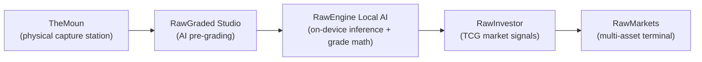

# Joseph Edwards — GatoGodMode

**CTO. Developer of CRMs, custom capture platforms, and business solutions for construction, solar, and roofing — with bank- and government-grade integration experience.**

I build the systems businesses actually run on: custom CRMs (from-scratch and on-platform), automation suites, payout engines, field-operations tooling, and local-first products for collectors and investors. Prepared to work with local and state level jurisdictions, lenders, and other sensitive-data environments.

### Daily Drivers

**Languages & Runtimes**

**Frameworks & Tooling**

**Data & AI**

**Business Platforms & APIs**

**Web & CMS**

**Productivity & OS**

**Creative**

**AI Dev Tools**

### Certifications

---

## What I Build

**Custom CRM & business platforms** — multi-tenant CRMs built from scratch and deep customization of platform CRMs. Role-based access control, field-level PII governance, multi-role assignment (sales agents, project managers, regional managers), customer and agent portals, document/agreement vaults, and audit trails.

**Enterprise Zoho development** — ran a production Zoho org for a multi-state solar/roofing operation with roughly **100 workflows and automations** spanning project scopes, activities, and pipeline stages:

- **Zoho Flow** automation suites orchestrating cross-app processes end to end
- **Custom modules and calculators inside Zoho CRM** for advanced payout and commission math
- **Custom portals** for customers and sales agents with multiple assignment models
- **Automatic notifications with processing math** baked into the pipeline
- Full-stack adoption across **Zoho CRM, Projects, Analytics, WorkDrive, and Flow**

*(The org served a company that has since wound down, so the live deployment isn't publicly demonstrable — but the patterns live on in everything below.)*

**Integrations, APIs & webhooks** — production webhook and API integrations with **banks/lenders** (financing flows) and **permitting jurisdictions**, plus Google Workspace sync, marketplace APIs, and document pipelines. Data migration between systems is routine work: CSV/structured imports, idempotent dated SQL migrations, dedupe-on-ingest, export/import tooling.

**Sensitive-data discipline** — development experience at bank and government level: role-scoped visibility, server-side key handling, audit/activity trails, and duplicate-safe, charset-safe migration practices.

### Selected Private Builds

> Client systems — described conceptually, never exposed.

**Multi-tenant solar/construction operations platform** — full lead-to-install pipeline: visual commission/payout formula builder, financing-provider registry tied to project records, permitting and jurisdiction tracking by county department, geofenced field PWAs with photo submission and time tracking, webhook-driven automation engine with delivery logs, public lead-capture forms, customer portal, and live WebSocket monitoring. TypeScript monorepo: ~313 source files, 44 API route modules, 18 admin feature modules.

**Field-operations CRM for multi-region installation crews** — four role-scoped experiences (admin console, CRM desk, foreman mobile, restricted crew shell), two-way Google Calendar sync and Drive mirroring, QR crew check-in with geofenced sites, guided photo/video proof-of-work with GPS/timestamp forensics, permit document OCR, SLA dashboards and shift analytics, bilingual EN/ES field UX. React + Express + MySQL with dated idempotent migrations.

---

## Philosophy: Move on Signal, Not Noise

Most collector and investor workflows look like this: a dozen marketplace tabs, unverified "last sold" prices skewed by scalper noise, browser-tracked history, and decision fatigue — *buy or hold?* — answered by gut feeling.

Everything I build inverts that:

| | Traditional Norm | The Raw Approach |
|---|---|---|
| **Data Sourcing** | Manual, multi-tab search across isolated sites | Unified, automated multi-source capture |
| **Analysis** | Descriptive ("what happened") | Prescriptive — actionable decision signals |
| **Privacy** | Cloud-dependent, browser-tracked | 100% local processing, local APIs, your data stays on your machine |

---

## The Raw Ecosystem

Five projects, one pipeline: from physical capture, to local AI grading, to market intelligence.

---

## RawEngine Local AI

> The privacy-first, on-device AI core powering the ecosystem.

**Problem:** AI grading and analysis tools typically mean uploading your collection to someone else's cloud — and trusting a black box that hallucinates grade numbers.

**How it works:** RawEngine deliberately separates *perception* from *judgment*:

1. **Vision stage (local LLM inference)** — a locally-run vision model performs phased evidence passes: OCR and card text extraction, identity resolution against TCG databases, qualitative centering notes, and defect cataloging across front, back, and video frames. It catalogs evidence; it never assigns grades.
2. **Deterministic math stage** — a rules-based engine computes every numeric subgrade and PSA/BGS/CGC prediction from the cataloged defects, risk factors, and *measured* centering. Grade snapping, floors/ceilings, and cross-company consistency are enforced in code, not guessed by a model.

**Architecture:** local inference runtime on loopback, with an optional bring-your-own-key cloud fallback for higher-accuracy passes. With local mode, **no card image ever leaves your PC**. Standard and Deep analysis modes trade speed for forensic depth. Output is treated as a research estimate — honest about being a tool, not an oracle.

---

## RawGraded Studio — [rawgraded.com](https://rawgraded.com)

> Know whether a card is worth grading *before* you pay grading fees.

**Problem:** Submitting a card to PSA/BGS/CGC costs real money per card with weeks of turnaround. Most collectors submit on hope and get burned by surface or centering issues they didn't catch.

**How it works:** A guided desktop pre-grading workflow:

**capture → crop → PSA-style centering measurement → optional 5-stage guided video forensics (tilted light, macro, back scan) → RawEngine evidence passes → deterministic grade math → certificate export → local portfolio**

**Architecture:** Windows desktop app (web-tech UI in a native shell) with a companion mobile capture app, a local database for portfolio/provenance, and pluggable AI providers (local-first, optional BYOK cloud). An optional hosted vault and public archive exist at rawgraded.com — but desktop grading requires no account at all.

**Highlights:** live sharpness and border-detection guidance, slab authenticity checking, fake-slab identification guide, printable certificates and social exports, per-card market refresh.

---

## RawInvestor

> A local-first TCG investing workstation: buy, hold, grade, or sell — with math, not vibes.

**Problem:** Deciding what to do with a raw card means juggling PriceCharting, TCGplayer, and eBay sold listings by hand, with no unified view, no grading expected-value math, and pricing distorted by scalper noise.

**How it works:** One workspace blends sold listings and market prices from all three major sources into per-card decision signals:

- **Market Bias** — synthesized Buy / Hold / Sell guidance from buyer-side and seller-side analytics
- **Trend** — regression slope, z-score vs. historical mean, day-over-day moves across **1 / 7 / 30 / 90-day windows**
- **Sales Strategy** — SELL/HOLD signals with fair, strategic, and pushed price targets per channel
- **Grading EV** — expected value across PSA 10 / 9 / fail branches (population-data-tuned probabilities), vs. a raw-flip projection with break-even pricing
- **90-day ROI forecast** — realistic / best / worst cases with trend clamping to avoid wild extrapolation on thin data

**Architecture:** desktop app with an embedded browser workspace, a **loopback-only local API**, and a local database as the authoritative portfolio store. An optional browser extension captures live marketplace context from your real sessions and posts it only to your own machine. No vendor cloud sync, no account, no tracking.

**Highlights:** Nebula 3D portfolio classification (Buy / Sell / Hold / Sleeper / Climber / Dud / NGMI), deal-hunting "Arsenal" targets, sealed product EV, themed share graphics, streamer mode.

---

## RawMarkets

> A personal markets terminal for metals, energy, and equities — local-first, with an AI copilot.

**Problem:** Self-directed investors juggle quote sites, news feeds, spreadsheets, and paid API keys just to see their own positions in context.

**How it works:** A phased bootstrap (hydrate → news → market → portfolio) pulls live quotes, metals spot prices, and RSS news into a local database, then layers analysis on top:

- **Portfolio discipline signals** — barbell drift detection, fractional Kelly caps, disposition checks, FOMO cooldowns, quarterly rebalance nudges, fragility alerts
- **News Bay** — watchlist-aware feed lanes with sentiment scoring and an in-app reader
- **Statements Analyzer** — import broker CSVs, classify transactions, reconcile into the portfolio
- **Local AI Copilot** — a locally-run model with retrieval context from *your* holdings, quotes, news, and research

**Architecture:** desktop terminal (web-tech UI + local API server + local database), with browser-automation-powered price feeds as the default — so live data works **without paid market APIs**. Cloud AI is optional; local AI and all portfolio data stay on-device. Full database export/import for backup and migration.

---

## TheMoun — [themoun.com](https://themoun.com) (Physical Product)

> An integrated capture workstation for cards, coins, and slabs. The bench is where margin leaks.

**Problem:** Sellers and graders assemble capture setups from unrelated SKUs — light tents, ring lights, tripods, centering templates — producing glare, inconsistent framing, and poor signal for downstream AI grading, image search, and marketplace comps.

**How it works:** One purpose-built imaging bench: a specimen deck, controlled task lighting, and repeatable phone-capture geometry, designed as a single system instead of a pile of accessories. Clean, consistent imagery feeds directly into the RawEngine AI layer.

**Product line (EPIC):** **E**co → **P**ro → **I**nvestor → **C**urator — from a mechanical-first static bench up to a sensor-driven, motion-controlled production station, with a future bulk-throughput line.

**Design highlights:** unified TCG + coin reference geometry via removable translucent guides, flippable mark-free deck inserts for clean AI/listing imagery, medical-grade silicone edge protection, and modular serviceability — replaceable wear parts instead of glued monoliths.

**Go deeper:** [Product Whitepaper](docs/TheMoun-Whitepaper.md) · [Market Research](docs/TheMoun-Market-Research.md)

---

## Stack at a Glance

Local-first by default. Plugin-style architectures. Deterministic math where it matters, AI where it helps.

---

## Contact

- **LinkedIn:** [linkedin.com/in/josephedwardscto](https://www.linkedin.com/in/josephedwardscto/)
- **X:** [@GatoGodMode](https://x.com/GatoGodMode)
- **Web:** [rawgraded.com](https://rawgraded.com) · [themoun.com](https://themoun.com)
