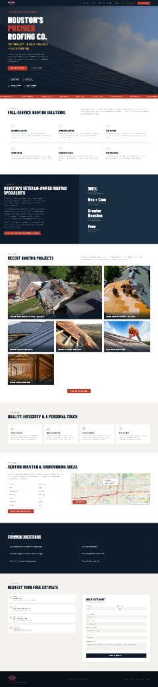
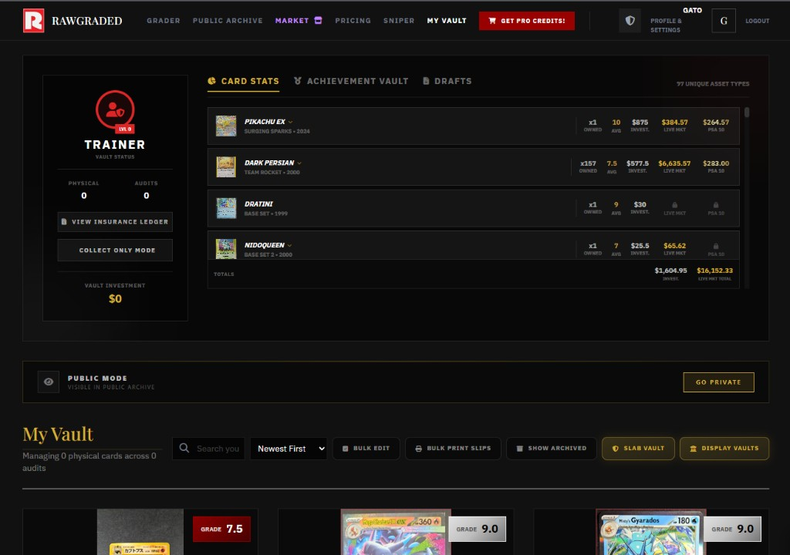
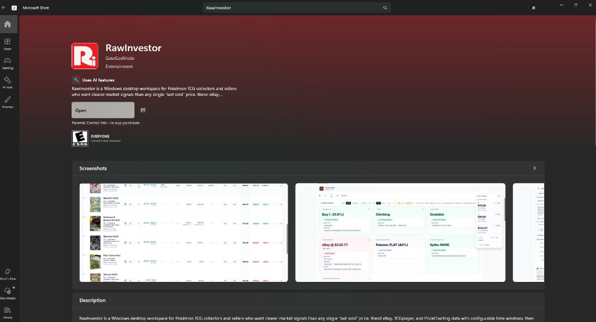
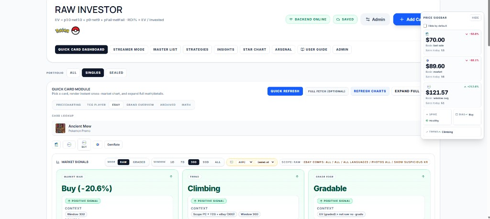
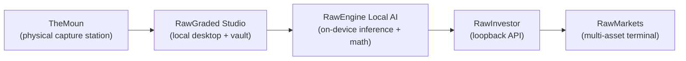

  

> [!NOTE]
> **This GitHub profile is a professional portfolio**, not an open-source community or maintainer program. Most of my career is in **private, proprietary** enterprise and client systems; linked repositories are **reviewable case studies and assurance excerpts** for IAM, CRM, security, and implementation depth.

  
  

<h1 align="center">Joseph Edwards · GatoGodMode</h1>

  <strong>Cyber Security · IAM · CRM Engineering</strong> — I ship access-controlled business systems with audit-grade discipline.

  <strong>Open to contract and full-time roles:</strong> CRM Systems Engineer · Business Systems Engineer · Salesforce / Zoho Administrator-Developer · IAM Analyst / IAM Engineer · Security Automation Engineer · Internal Tools Engineer · Solutions / Technical Implementation Engineer · IT Systems Administrator (automation + security)

  
  
  
  
  

- **IAM & access control** — entity/field RBAC, MFA, audit trails, PII field governance; [StrikeScope](https://github.com/GatoGodMode/StrikeScope) + bank/government-grade integration patterns
- **CRM & business systems** — production Zoho org (~100 automations), Salesforce certified (Admin + Advanced Admin), multi-tenant CRMs, lender/permitting API integrations
- **Security automation & delivery** — migration tooling ([DNS-Sentinel](https://github.com/GatoGodMode/DNS-Sentinel)), hardened client deployments, idempotent SQL migrations, internal tools

### If you're hiring for…

| Role focus | Start here |
|---|---|
| **IAM / security engineering** | [StrikeScope IAM](#strikescope--iam--platform-engineering) · [RawGraded assurance](https://github.com/GatoGodMode/RawGraded#security-posture-at-a-glance) · [RawInvestor loopback auth](https://github.com/GatoGodMode/RawInvestor#security-architecture-visual-layouts) · [RoofRoofTexas hardening](#roofrooftexas--full-rebuild-case-study) |
| **CRM / business systems** | [Zoho at scale](#crms--zoho-at-scale--banks--permitting-integrations) · [StrikeScope pipeline](#strikescope--iam--platform-engineering) · [RoofRoofTexas case study](#roofrooftexas--full-rebuild-case-study) |
| **Solutions / internal tools / implementation** | [DNS-Sentinel](#dns-sentinel--migration-dns-auditing) · [OrphanHunter](https://github.com/GatoGodMode/OrphanHunter) · [Portfolio at a glance](#portfolio-at-a-glance) |

  
  
  
  
  

> **Secure the identity layer. Automate the CRM. Audit everything.** Role-scoped data, server-side secrets, idempotent migrations — production systems, not slide decks.

  

## About this portfolio

> Most of my engineering career has been in **private, proprietary** enterprise and client systems — CRMs, IAM platforms, integrations, and security automation. This GitHub is **selective public evidence** for recruiters and security reviewers: architecture, IAM patterns, CRM delivery, and audit-grade implementation. Each linked repo is a case study I can share; the rest stays with clients.

---

## Enterprise & CRM Development

*Click a bar to expand.*

<picture></picture>

 

**Custom CRM & business platforms** — multi-tenant CRMs built from scratch and deep customization of platform CRMs. Role-based access control, field-level PII governance, multi-role assignment (sales agents, project managers, regional managers), customer and agent portals, document/agreement vaults, and audit trails.

**Contract/consulting engagement:** configured a production Zoho org for a since-wound-down multi-state solar/roofing operator (independent engineering work — not an employee of that company or of Zoho) with roughly **100 workflows and automations** spanning project scopes, activities, and pipeline stages:

- **Zoho Flow** automation suites orchestrating cross-app processes end to end
- **Custom modules and calculators inside Zoho CRM** for advanced payout and commission math
- **Custom portals** for customers and sales agents with multiple assignment models
- **Automatic notifications with processing math** baked into the pipeline
- Full-stack adoption across **Zoho CRM, Projects, Analytics, WorkDrive, and Flow**

*(The org served a company that has since wound down, so the live deployment isn't publicly demonstrable — but the patterns live on in everything below.)*

**Integrations, APIs & webhooks** — production webhook and API integrations with **banks/lenders** (financing flows) and **permitting jurisdictions**, plus Google Workspace sync, marketplace APIs, and document pipelines. Data migration between systems is routine work: CSV/structured imports, idempotent dated SQL migrations, dedupe-on-ingest, export/import tooling.

**Security patterns aligned with regulated environments** — banking- and government-style RBAC, role-scoped visibility, server-side key handling, audit/activity trails, and duplicate-safe, charset-safe migration practices.

<picture></picture>

 

> Client systems — described conceptually unless linked below.

**[StrikeScope](https://github.com/GatoGodMode/StrikeScope)** — portfolio case study: self-hosted multi-tenant CRM with **entity + field-level RBAC**, TOTP MFA, audit trail, Activepieces orchestration, and Dev Studio AI that observes schema/code structure. Full lead-to-install pipeline (commissions, financing, territory, field PWAs, customer portal). [IAM model](https://github.com/GatoGodMode/StrikeScope/blob/main/docs/SECURITY-IAM.md) · [Sentinel roadmap (WIP)](https://github.com/GatoGodMode/StrikeScope/blob/main/docs/ROADMAP-SENTINEL.md)

**Field-operations CRM for multi-region installation crews** — four role-scoped experiences (admin console, CRM desk, foreman mobile, restricted crew shell), two-way Google Calendar sync and Drive mirroring, QR crew check-in with geofenced sites, guided photo/video proof-of-work with GPS/timestamp forensics, permit document OCR, SLA dashboards and shift analytics, bilingual EN/ES field UX. React + Express + MySQL with dated idempotent migrations.

**Public case study:** see [RoofRoofTexas EXPAND](#roofrooftexas--full-rebuild-case-study) below.

<picture></picture>

 

> Self-hosted CRM built to demonstrate enterprise IAM and a credible path toward local AI security operations.

**Shipped IAM:** JWT + bcrypt + optional TOTP MFA · entity CRUD permissions per role · **field-level PII** (`ssn_last_four`, `date_of_birth`, co-signer fields) · multi-company membership · audit trail · scoped automation service keys · Helmet + rate limits.

**Platform:** Express + SQLite monorepo · Admin CRM + Server Admin · Field/Installer/Monitor PWAs · Activepieces event orchestration · Dev Studio local AI (RAG over schema, migrations, ship/rollback).

**WIP:** [Sentinel roadmap](https://github.com/GatoGodMode/StrikeScope/blob/main/docs/ROADMAP-SENTINEL.md) — local AI SIEM/SOAR with company-maintained playbooks (documented, not fake-shipped).

**Go deeper:** [Repository](https://github.com/GatoGodMode/StrikeScope) · [SECURITY-IAM.md](https://github.com/GatoGodMode/StrikeScope/blob/main/docs/SECURITY-IAM.md) · [Architecture](https://github.com/GatoGodMode/StrikeScope/blob/main/docs/ARCHITECTURE.md)

<picture></picture>

 

> Custom tooling for people who need extreme PDF compression without touching a terminal.

**Problem:** 50 MB scan PDFs blocked email and portal uploads. Existing shrinkers were CLI-only, conservative, or buried in IT tooling.

**Shipped:** Tkinter desktop app with **Ultra (max shrink)** Ghostscript profile, full preset ladder, Ghostscript + PyMuPDF raster modes, **Check Sizes** preview (runs every preset before commit), and **only keep if smaller** safety. Portable **73 MB exe** bundles Ghostscript — double-click for office staff.

**Go deeper:** [Repository](https://github.com/GatoGodMode/PDF-Size-Reducer) · [Portable exe](https://github.com/GatoGodMode/PDF-Size-Reducer/blob/main/dist/PDF_Size_Reducer.exe)

<picture></picture>

 

> Custom tooling: turn line-art door designs into a print-ready luxury catalog — and recover when cloud source data is gone.

**Problem:** An unnamed manufacturer client needed photorealistic catalog renders from B&W line art at SKU scale. Cloud assets were later deleted; only the finished PDF survived.

**Shipped:** React + Vite app with **Gemini Nano Banana** (`gemini-2.5-flash-image` / `gemini-3.1-flash-image-preview`) queue processing, teal glass unification, jsPDF catalog export (covers, spreads, index), **PDF operator-list reverse engineering** to rebuild the IndexedDB queue from output PDF alone, WooCommerce ZIP export, and WP Media Mapper Chrome extension.

**Go deeper:** [Repository](https://github.com/GatoGodMode/LuxuryCatalog) · [Showcase renders](https://github.com/GatoGodMode/LuxuryCatalog/tree/main/assets/showcase)

<picture></picture>

 

> Built during a ~1 TB GoDaddy M365 → Google Workspace cutover when registrar and vendor support couldn't agree on DNS state.

**Problem:** Mid-migration email failures with blame shifting across GoDaddy, Microsoft, and Namecheap — no single view of MX, SPF, DMARC, SMTP reachability, or site stack exposure.

**Shipped:** Full-stack audit tool — domain score (SSL, headers, path exposure), email provider heuristics (Google/M365/GoDaddy legacy), SMTP + MX banner tests, WordPress vs **Vite dist** detection with optional deep scan, SQLite audit history, and **server-proxied Gemini** fix guides and migration chat.

**Go deeper:** [Repository](https://github.com/GatoGodMode/DNS-Sentinel)

<picture></picture>

 

> Public case study: full redesign, re-architecture, security hardening, and local SEO for a Houston roofing company — built lean on purpose.

**Problem:** Thin one-pager — no project gallery, mobile nav hidden below 768px, client-side-only form validation, SEO artifacts referenced but never deployed.

**Shipped:**

- **Design system** — brand-aligned navy/red palette, SVG icon sprite, consistent card and section language
- **Real proof content** — project gallery with responsive photography and aerial drone flyovers
- **Live service-area map** — interactive coverage across **14 Greater Houston cities**, lazy-loaded with integrity-pinned CDN
- **Media pipeline** — multi-MB source photos and 4K drone video compressed to **sub-2 MB** WebP/MP4 deliverables
- **Conversion form** — CSRF, honeypot, minimum-delay check, per-IP rate limiting, origin/referer whitelisting, server-side sanitization (no third-party CAPTCHA)
- **Server hardening** — CSP, HSTS (1 year), `X-Frame-Options`, `nosniff`, referrer/permissions policies; PHP execution blocked under `/assets`
- **SEO infrastructure** — full JSON-LD `@graph` (RoofingContractor, FAQPage, VideoObject, ItemList), sitemap, robots, `llms.txt`, geo meta, Open Graph + Twitter Cards
- **Accessibility** — skip links, ARIA landmarks, keyboard-operable accordion, reduced-motion and save-data video gating, WCAG 2.2.2 media pause control

**Before / After**

| Before | After |
|:---:|:---:|
|  |  |

**Go deeper:** [Case study repo](https://github.com/GatoGodMode/RoofRoofTexas-Rebuild) · [Live site](https://roofrooftexas.com)

---

## Portfolio at a glance

Business systems, IAM, and security work first — then shipped desktop products used as assurance publications.

**Tier 1 — Business systems, IAM, security**

| Project | One-liner | Status |
|---|---|---|
| **[StrikeScope](https://github.com/GatoGodMode/StrikeScope)** | Self-hosted CRM + IAM — entity/field RBAC, MFA, audit, automation orchestration | Portfolio case study |
| **[RoofRoofTexas rebuild](https://github.com/GatoGodMode/RoofRoofTexas-Rebuild)** | Client site — CSP/HSTS, hardened forms, SEO infrastructure | [Live](https://roofrooftexas.com) · case study |
| **[DNS-Sentinel](https://github.com/GatoGodMode/DNS-Sentinel)** | M365 → Google Workspace DNS/migration auditing | Portfolio tool |
| **[OrphanHunter](https://github.com/GatoGodMode/OrphanHunter)** | Web app crawl — SQL/table/reference audit for migrations | Portfolio tool · v1.3 |
| **[PDF Size Reducer](https://github.com/GatoGodMode/PDF-Size-Reducer)** | Desktop PDF shrinker — Ultra preset, size preview, portable exe | Portfolio tool |
| **[LuxuryCatalog](https://github.com/GatoGodMode/LuxuryCatalog)** | AI catalog pipeline with PDF disaster-recovery reverse engineering | Portfolio tool |
| **Zoho production org** | ~100 workflows/automations, Flow, custom modules — see [Enterprise section](#crms--zoho-at-scale--banks--permitting-integrations) | Private client work |

**Tier 2 — Shipped desktop apps & assurance publications**

| Project | One-liner | Status |
|---|---|---|
| **[RawGraded](https://github.com/GatoGodMode/RawGraded)** | Desktop + vault API — **assurance publication** (SPII strip, threat model) | Shipping · reviewable source |
| **[RawInvestor](https://github.com/GatoGodMode/RawInvestor)** | Local-first desktop — **loopback API, token auth**, Microsoft Store | Shipping · assurance repo |
| **RawMarkets / RawEngine / [TheMoun](https://themoun.com)** | Internal R&D and hardware program | In progress · secondary |

Published research (non-hiring primary)

| Project | One-liner | Status |
|---|---|---|
| **[CollectorBuyerPsych](https://github.com/GatoGodMode/CollectorBuyerPsych)** | Cited neuro-economic research on collectibles and digital asset markets | Published research |

Collapsible deep dives below.

---

## Tech Stack

**Certifications:**

**CRM platforms, IAM patterns, and integration automation first.** TypeScript/Node for internal tools; Zoho Flow/Deluge and Salesforce for business systems; audit-grade migrations and server-side secret handling throughout.

<picture></picture>

 

**Languages & Runtimes**

**Frameworks & Tooling**

**Data & AI**

**Business Platforms & APIs**

**Web & CMS**

**Productivity & OS**

**Creative**

**AI Dev Tools**

---

## Shipped products — assurance deep dives

*Secondary section: shipped desktop products used as **security and architecture case studies**. Domain-specific UI; the hiring signal is IAM patterns, loopback APIs, audit discipline, and release integrity.*

*Click a bar to expand.*

<picture></picture>

 

Most enterprise data workflows still look like this: siloed tabs and exports, unverified third-party feeds, browser-tracked history, and decisions made without a unified audit trail.

Everything I build inverts that:

| | Traditional Norm | Local-controlled approach |
|---|---|---|
| **Data sourcing** | Manual, multi-tab search across isolated systems | Unified, automated multi-source capture |
| **Analysis** | Descriptive ("what happened") | Prescriptive — actionable decision signals |
| **Privacy & control** | Cloud-dependent, vendor-tracked | Local processing, loopback APIs, data stays on-device |

<picture></picture>

 

> **Local-first AI core** — loopback inference, evidence cataloging, deterministic math layer. No cloud upload required for the default path.

**How it works:** RawEngine deliberately separates *perception* from *judgment*:

1. **Vision stage (local LLM inference)** — phased evidence passes: OCR/text extraction, identity resolution, qualitative notes, and defect cataloging across image and video frames. It catalogs evidence; it never assigns final scores in the model layer.
2. **Deterministic math stage** — a rules-based engine computes numeric outputs from cataloged defects, risk factors, and measured geometry. Floors, ceilings, and cross-run consistency are enforced in code, not guessed by a model.

**Architecture:** local inference runtime on loopback, with optional bring-your-own-key cloud fallback. With local mode, **sensitive imagery never leaves the machine**. Standard and Deep analysis modes trade speed for forensic depth. Output is treated as a research estimate — auditable, not a black box.

<picture></picture>

 

> **Assurance publication** — local-first desktop, PHP vault API, SPII strip on public verify, documented threat model.

**Architecture:** Windows desktop app (web-tech UI in a native shell) with companion mobile capture, local database for portfolio/provenance, and pluggable AI providers (local-first, optional BYOK cloud). Optional hosted vault at rawgraded.com — desktop workflow requires no account.

**Assurance publication:** [GatoGodMode/RawGraded](https://github.com/GatoGodMode/RawGraded) — reviewable excerpt (Electron desktop, PHP vault API, landing). Secrets load from runtime settings at deploy time; operator config and schema migration stay out of band. Release integrity gate: `node scripts/publish-preflight.cjs`.

**Security highlights:** server-side SPII strip on public cert verify; **GO PRIVATE** archive control; deterministic grade math with auditable `mathTrace` — not black-box LLM output — [vault records & SPII controls →](https://github.com/GatoGodMode/RawGraded#vault-records-provenance-capture-and-indemnity-documentation)

**Built for production**

| Scale | Security | Polish |
|:---:|:---:|:---:|
|  |  |  |
| Chunked insurance ledger PDF with progress over **250+ assets** | Server-side SPII strip on public cert verify; **GO PRIVATE** archive control | Three.js viewer with pattern inference |

- Portfolio-grade PDF export with sectioned rendering and live progress UI
- Full vault provenance capture, envelope OCR, and insurance ledger
- [Platform showcase (screenshots) →](https://github.com/GatoGodMode/RawGraded#platform-showcase)

<picture></picture>

 

> **Assurance publication** — loopback-only Express API, token auth, local SQLite authority, MV3 extension posting only to localhost.

**Architecture:** desktop app with embedded browser workspace, **loopback-only local API**, and local database as the authoritative store. Optional browser extension captures live marketplace context from user sessions and posts it only to the local machine. No vendor cloud sync, no account, no tracking.

**Shipped on Microsoft Store**

| Distribution | Product UI | Security posture |
|:---:|:---:|:---:|
|  |  | Loopback-only API · token auth · no cloud sync |
| First RAW ENGINE Microsoft Store listing · **Uses AI features** badge | Local portfolio analytics and decision signals | Reviewable assurance repo with preflight gate |

**Assurance publication:** [GatoGodMode/RawInvestor](https://github.com/GatoGodMode/RawInvestor) — reviewable excerpt (Electron, loopback Express API, MV3 extension). Release integrity gate: `node scripts/publish-preflight.cjs`.

**Go deeper:** [Security architecture](https://github.com/GatoGodMode/RawInvestor#security-architecture-visual-layouts) · [Security posture](https://github.com/GatoGodMode/RawInvestor#security-posture-at-a-glance) · [How it works](https://github.com/GatoGodMode/RawInvestor#how-the-software-works) · [Microsoft Store listing](https://apps.microsoft.com/detail/9PGX48NMDWQT)

<picture></picture>

 

**Problem:** Self-directed investors juggle quote sites, news feeds, spreadsheets, and paid API keys just to see their own positions in context.

**How it works:** A phased bootstrap (hydrate → news → market → portfolio) pulls live quotes, metals spot prices, and RSS news into a local database, then layers analysis on top:

- **Portfolio discipline signals** — barbell drift detection, fractional Kelly caps, disposition checks, FOMO cooldowns, quarterly rebalance nudges, fragility alerts
- **News Bay** — watchlist-aware feed lanes with sentiment scoring and an in-app reader
- **Statements Analyzer** — import broker CSVs, classify transactions, reconcile into the portfolio
- **Local AI Copilot** — a locally-run model with retrieval context from *your* holdings, quotes, news, and research

**Architecture:** desktop terminal (web-tech UI + local API server + local database), with browser-automation-powered price feeds as the default — so live data works **without paid market APIs**. Cloud AI is optional; local AI and all portfolio data stay on-device. Full database export/import for backup and migration.

Hardware R&D · TheMoun (secondary)

 

Integrated physical capture workstation — hardware R&D program, not a primary hiring signal. [themoun.com](https://themoun.com) · [Whitepaper](docs/TheMoun-Whitepaper.md) · [Market Research](docs/TheMoun-Market-Research.md) · [Schematics](docs/TheMoun-Schematics.md)

RAW product pipeline (continuity reference)

 

---

## Legal & third-party notice

Third-party names, logos, and certifications (Zoho, Salesforce, Microsoft, Google, PSA, Pokémon, etc.) are used descriptively only. **No endorsement, partnership, employment, or agency relationship is implied.** Past client work describes independent engineering engagements unless explicitly labeled as a public case study repository. **Linked repositories are portfolio and assurance publications for review, not open-source projects soliciting contributions.**

---

## Contact

- **Target roles:** CRM Systems Engineer · Business Systems Engineer · Salesforce / Zoho Administrator-Developer · IAM Analyst / IAM Engineer · Security Automation Engineer · Internal Tools Engineer · Solutions / Technical Implementation Engineer · IT Systems Administrator (automation + security)
- **Availability:** Contract or full-time · [LinkedIn](https://www.linkedin.com/in/josephedwardscto/) *(primary contact)*
- **LinkedIn:** [linkedin.com/in/josephedwardscto](https://www.linkedin.com/in/josephedwardscto/)
- **X:** [@GatoGodMode](https://x.com/GatoGodMode)
- **Shipped products:** [rawgraded.com](https://rawgraded.com) · [Microsoft Store — RawInvestor](https://apps.microsoft.com/detail/9PGX48NMDWQT) · [themoun.com](https://themoun.com)
