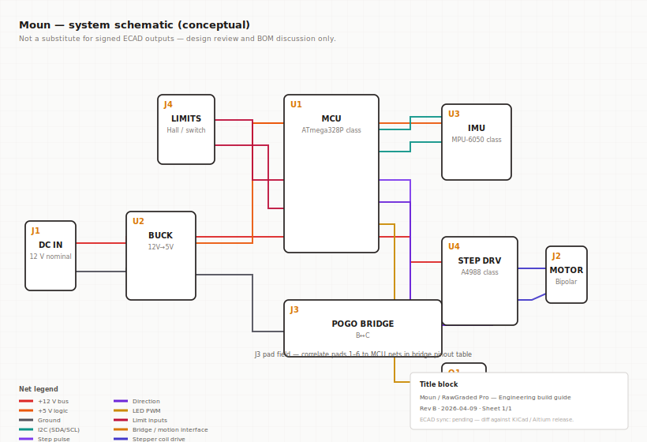
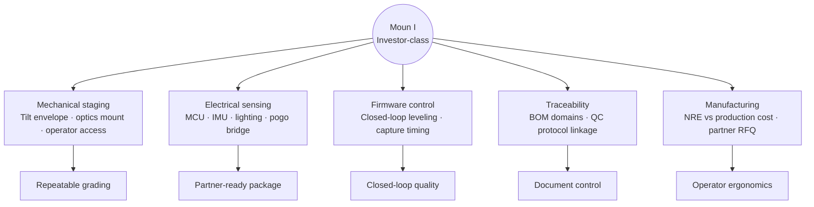

# TheMoun — Model Schematics

> Engineering communication artifacts for the Moun hardware program — mechanical orthographics, system electrical schematic, and CAD reference mesh.
>
> [themoun.com](https://themoun.com) · [Whitepaper](TheMoun-Whitepaper.md) · [Market Research](TheMoun-Market-Research.md)

*Conceptual diagrams for design review and diligence — not signed production releases. Confirm dimensions, pinout, and BOM against released ECAD/STEP before manufacturing.*

---

## Scope by EPIC Stage

| Stage | SKU | Schematics in this document |
|---|---|---|
| **E** | Moun E (Eco) | Structural CAD narrative in [Whitepaper](TheMoun-Whitepaper.md); static bench — **no MCU/motion stack** |
| **P** | Moun P (Pro) | Static printed bay + in-box LED harness; mechanical assembly views in engineering build |
| **I** | Moun I (Investor) | **Full stack below** — mechanical front ortho, system electrical schematic, reference OBJ mesh |
| **C** | Moun C (Curator) | Forward-looking bulk line; engineering trails Stages 1–3 |

Eco and Pro are static capture benches. The diagrams in this document describe the **production-intent Moun I (Investor-class)** electromechanical architecture that Curator inherits.

---

## Mechanical — Front Orthographic Schematic

Desk-mounted open frame: base slab, vertical pillars, top cross-member, recessed inspection bed, dual motor concept under the staging plane, side control cluster, and top shroud for imaging/diffuser.

### Callout reference

| ID | Subsystem | Summary | Assembly notes |
|---|---|---|---|
| **frame** | Main frame | Base, pillars, top beam — desk-mounted open frame per CAD envelope | Verify squareness and fastener torque before drivetrain install |
| **accents** | Orange accent features | Oval caps on pillars, beam, and base — UI or cosmetic per industrial design | If functional (buttons/LED bezels), define IP rating and actuator travel |
| **bed** | Inspection bed | Recessed platform with card/slab staging region | Align optical axis and lighting baffle to this plane; add datum features for calibration |
| **drive** | Linear drive | Paired motor/gear modules under bed — platform translation intent | Belt/screw selection, encoder vs open-loop, stall detection TBD |
| **controls** | Side control cluster | Knob, toggle, power on pillar — local human interface | Wire routing through pillar; strain relief and service access from rear |
| **lid** | Top plate / shroud | Removable plate — may carry camera, diffuser, or dust cover | Define hinge or magnet retention; mass affects vibration spec |

**Open engineering items:** final materials (ABS vs aluminum extrusion), motor specs, leadscrew/belt pitch, hard stops vs software limits, imaging module mount pattern, planarity tolerance on staging plane.

---

## Electrical — System Schematic (Conceptual)

Production-intent block diagram for Moun I: 12 V input, buck to 5 V logic, MCU hub, IMU on I²C, stepper driver + motor, limit inputs, LED PWM dimming via NFET, and **J3 pogo bridge** as the modular motion interface between stationary and moving electronics.

### Block summary

| Ref | Block | Role |
|---|---|---|
| **J1** | DC IN | 12 V nominal input |
| **U2** | BUCK | 12 V → 5 V logic rail |
| **U1** | MCU | ATmega328P-class control hub |
| **U3** | IMU | MPU-6050-class leveling / tilt sensing |
| **U4** | STEP DRV | A4988-class stepper driver |
| **J2** | MOTOR | Bipolar stepper load |
| **J3** | POGO BRIDGE | 6-pad modular interface (B↔C motion partition) |
| **Q1** | NFET | LED PWM dimming |
| **J4** | LIMITS | Hall / switch limit inputs |

### Net legend

| Net | Function |
|---|---|
| VIN12 | +12 V bus |
| V5 | +5 V logic |
| GND | Ground |
| I2C | SDA/SCL to IMU |
| STEP / DIR | Stepper pulse and direction |
| LED_PWM | Task lighting dim control |
| LIMIT | Low/high limit inputs |
| BRG | Bridge / motion interface pads |
| MOT | Stepper coil drive |

**Title block:** Rev B · 2026-04-09 · ECAD sync pending — diff against KiCad / Altium release before RFQ.

**Firmware domains tied to schematic refs:** MCU (closed-loop leveling, calibration hooks), IMU (tilt read), step driver (motion), bridge (modular pad field), LED PWM (illumination timing), limits (hard-stop awareness).

---

## CAD Reference Mesh

3D reference mesh exported from TinkerCAD — single merged envelope for the Investor-class chassis concept. Per-part BOM linkage requires re-export with separated bodies or STEP for production RFQ.

| Asset | Format | Notes |
|---|---|---|
| [moun-investor-reference.obj](assets/themoun/moun-investor-reference.obj) | Wavefront OBJ (~0.9 MB) | Merged mesh; load with companion MTL |
| [moun-investor-reference.mtl](assets/themoun/moun-investor-reference.mtl) | Material library | Paired with OBJ |

**Provenance:** exported from TinkerCAD (`tinker.obj` lineage). Orange accent geometry in source CAD communicates task-light zones — not a released EBOM.

### Moun E structural views (Eco)

Eco CAD emphasizes **head ↔ post ↔ base** pin-lock height rail:

- Editor explode — spacer block shows post/bridge stack-up
- Assembled hero — dual charcoal pillars, overhead deck, height-index holes
- Side structural — top lattice, base footprint, column/arm layout
- Modular trio — deck tray, indexed post, seated bridge for pack-out sequencing
- Underside detail — grey/orange pockets for dual-plane lighting callouts

Detailed captions in the [Whitepaper — Moun E Structural CAD](TheMoun-Whitepaper.md#moun-e--structural-cad-story) section.

---

## Engineering Hub Map

---

## Document Control

| Field | Value |
|---|---|
| Title | Moun / RawGraded Pro — Engineering build guide |
| Revision | Rev B |
| Date | 2026-04-09 |
| Author | Joseph Edwards |
| CAD provenance | TinkerCAD export; per-part BOM requires separated bodies or STEP |

**Change log**

| Rev | Date | Note |
|---|---|---|
| Rev B | 2026-04-09 | SVG ortho schematics, OBJ viewer, document control blocks |
| Rev A | 2026-04-01 | Initial static blueprint |

---

*Published for portfolio and diligence showcase · Last updated: 2026-06-10*
