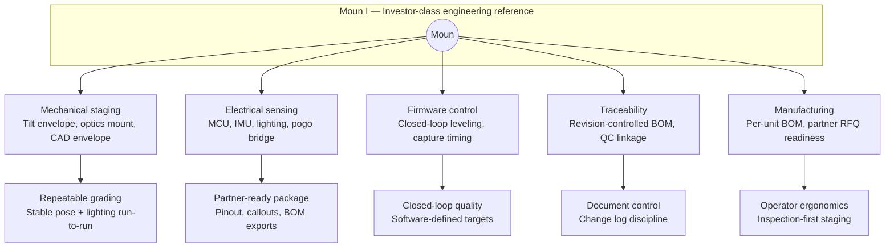

# TheMoun — Product Whitepaper

> The phone already won — the bench is where margin leaks.
>
> [themoun.com](https://themoun.com) · Companion AI layer: [rawgraded.com](https://rawgraded.com)

*Published edition — product thesis, EPIC staged rollout, engineering architecture summary, and IP preparation themes. Detailed schematics and CAD reference: [Model Schematics](TheMoun-Schematics.md).*

---

## Thesis

Live shopping (Whatnot, eBay, short-form discovery) made the handset central to collectibles commerce — from solo sellers to high-scale shops. The phone is the camera, the comp tool, and the checkout. But the **physical layer under the phone** never caught up: kitchen tables, convention spill light, and shaky improvised rigs produce glare, bad framing, and failed comps.

The sensor is fine. **The scene is not.**

Moun captures the hardware dollar on the layer that makes every comp, listing, and AI pass actually work — without a second capture device burning the clock.

## Pain Points

| | Why the status quo leaves money on the table |
|---|---|
| **Dirty scenes** | Marketplace, search, and AI tools assume a clean asset. Ambient light, glare, and inconsistent framing defeat them before software ever runs. |
| **Frankenstein stacks** | "Best-effort" piles of tents, tripods, and lamps were never one system. Setup and re-staging time scales linearly with volume — the wrong economics for professional throughput. |
| **The clock is the show** | High-velocity sellers run five-figure sessions in hours with the phone as camera and checkout. A parallel capture handoff wastes the narrow window. |
| **Category sprawl** | Shops cross cards, coins, bullion, jewelry, and watches — ad hoc lighting does not port across categories without re-rigging. |

## The Fix: One Integrated Workstation

Moun is a purpose-built inspection and capture bench: **specimen deck + controlled task lighting + repeatable phone- or tablet-friendly geometry in one sellable envelope.** The operator stays on the specimen: inspect, shoot, comp, list.

- **Unified deck, illumination, and capture path** — not another pile of unrelated SKUs
- **Lighting and plane tuned for reflective cards and slabs**, so downstream apps see the same asset every time
- **Phone-native throughput** at entry tiers; higher tiers bridge to desktop and partner workflows without abandoning floor ergonomics
- **Open staging** — clampless placement, no walled light tent, no swinging overhead arm blocking the phone screen

## Revenue & Opportunity

- **Hardware attach on existing spend** — sellers already pay for inventory and shows; Moun sells the layer that makes TikTok-, eBay-, and Whatnot-class workflows reliable in the feed
- **Live-commerce tailwind** — as simulcast selling grows, capture quality *is* conversion; bad lighting is lost GMV
- **Throughput equals margin** — seconds saved per lot compound across thousands of listings and high-dollar session days
- **TAM beyond TCG** — numismatics, precious metals, jewelry, and watches share the same comp motion with a larger basket
- **Software synergy** — clean, repeatable capture is exactly what AI grading pipelines ([RawGraded](https://rawgraded.com)) need to perform at full strength
- **IP optionality** — integrated apparatus claims plus continuation strategy along EPIC — diligence for counsel, not a promise of exclusivity

---

## The EPIC Line: Four Stages, One Family

The EPIC line does not bundle multiple SKUs into a single "Phase 1." There are four stages: **Stage 1 is Moun E (Eco) alone** — the introduction flagship. Stages 2–4 are Moun P, I, and C in order, each improving on the previous SKU with a clear step-up in features, electronics content, and manufacturing load.

| Code | SKU | Character | Mechanical vs electrical |
|---|---|---|---|
| **E** | **Moun E (Eco)** | Introduction flagship. Mechanical-first static capture bench with kitted commodity USB LED strips and phone bridge. Lowest-cost entry that proves the integrated capture thesis. | Plastic + mousepad from CM; two USB adhesive LED strips kitted at pack-out — **no custom CM electronics** |
| **P** | **Moun P (Pro)** | Static bay with in-box LED task lighting, harness, and kit assembly. Next retail release after Eco earns its tranche. | In-box LED harness + assembly vs Eco strip scope |
| **I** | **Moun I (Investor)** | Production-intent full station: engineered frame, sensing, MCU, modular pogo bridge, firmware closed loops, document-controlled BOM. | **Full electromechanical stack** — see [Schematics](TheMoun-Schematics.md) |
| **C** | **Moun C (Curator)** | Forward-looking bulk-throughput line for high-volume vendors and card rooms. Conveyor-fed workflow; engineering trails Stages 1–3. | Largest footprint and manufacturing complexity in the family |

### Stage 1 callout — why Eco leads

Stage 1 is only Moun E: mechanical-first Eco build (plastic + mousepad from the CM) plus two commodity USB-powered adhesive LED strips in the retail kit — sourced off-the-shelf and kitted, not custom CM electronics. It is the flagship introduction because it establishes the capture thesis, packaging story, and competitive edge versus fragmented retail for thousands of real-world use cases at a low landed-cost entry. Pro, Investor, and Curator follow as separate stages when the line is ready to step up.

**Stage 1 outcomes:** investable proof at the lowest CM scope; thousands of real-world use cases (shows, shops, mail-in prep); foundation for patents, packaging, and retail narrative that Stages 2–4 inherit.

---

## Engineering Architecture (Moun I reference)

The production-intent stack for **Moun I (Investor-class)** combines mechanical staging and motion, electrical sensing and lighting, and firmware closed-loop control. Eco and Moun P are static capture benches **without** this motion/MCU stack; the full stack matches Moun I and feeds the Curator roadmap.

**Magnetic pogo-bridge** is the modular interface between moving and stationary electronics — pinout must correlate to the released schematic before RFQ.

→ Full diagrams, callout tables, and downloadable mesh: **[Model Schematics](TheMoun-Schematics.md)**

---

## Moun E — Structural CAD Story

The Eco chassis is modeled as a **head ↔ post ↔ base** stack with pin-lock height indexing:

- **Head** carries the phone bridge and task-light pocket
- **Sliding rail** indexes in the base pillar; T-bridge and cross-pin set height before the head drops onto the peg stack
- **Orange / grey and copper pads** in CAD are communication geometry for the lit region — not a signed electrical BOM until EBOM freeze

Key structural reads documented in engineering:

| View | What it shows |
|---|---|
| Editor explode | Vertical stack-up with spacer block between bridge and keyed base slot |
| Assembled hero | Dual-post frame with capture deck, height-index holes on front column |
| Side structural | Top lattice, base footprint, column/arm layout for tolerance checks |
| Modular trio | Deck tray, indexed post + pilot frame, seated bridge for pack-out sequencing |
| Underside detail | Alternate grey/orange pockets for dual-plane lighting callouts |

---

## Physical Design Targets (Moun I)

*Targets tied to CAD reference mesh — verify on first article.*

| Domain | Parameter | Target | Notes |
|---|---|---|---|
| Motion | Tilt range | 85° | Confirm against hard stops, linkage, cable strain |
| Motion | Footprint | TBD | Record L × W × H at max extension from released STEP |
| Sensing | Lighting CRI | 95+ | Module PN, binning, thermal derating in electrical BOM |
| Sensing | Level accuracy | <0.2° | IMU mount stiffness, calibration, temperature drift |
| Interface | Bridge | Magnetic pogo | Retention force, wipe distance, cycle life in ECAD release |
| Materials | Frame | TBD | Alloy / polymer grades, anodize / powder coat spec |
| Human factors | Viewing angle | TBD | Nominal eye point vs display / optical path |

---

## Design Principles

- **Unified reference geometry** — removable translucent guides carrying both card registration frames and coin reference geometry on one sheet, replacing separate card grids and coin templates
- **Mark-free capture surfaces** — flippable deck inserts: an unmarked face for clean AI/listing imagery, a contrast face without molded-in guides
- **Specimen and operator protection** — soft-touch edge padding throughout contact zones
- **Modular serviceability** — replaceable guides, inserts, and wear items instead of glued monoliths

---

## IP Preparation Themes

*Invention themes for patent counsel — not claim language, prior-art analysis, or freedom-to-operate opinions.*

| Theme | Summary |
|---|---|
| **Integrated grading & valuation station (apparatus)** | Unified workstation combining specimen deck, controlled illumination, and docked capture within one physical product — distinct from ad hoc retail tool assemblies |
| **Card + coin measurement overlay** | Single removable overlay carrying both card centering frames and coin diameter rings on one planar sheet |
| **AI-assisted video grading (methods)** | Pipelines ingesting video/frame sequences under controlled capture, outputting structured grading results tied to the session |
| **Step-by-step grading with tilt/pose control** | Guided operator flows prescribing ordered capture steps including controlled tilt for repeatable evidence chains |
| **Slab authenticity validation** | Measurement and procedural practices for encapsulated slab validation tied to grading-linked value |

**Portfolio strategy:** treat Moun E as earliest reduction to practice; plan dependent claims and continuations as capability steps from Pro through Curator; coordinate utility vs design protection if chassis silhouette is distinctive.

**Trademark status:** "Moun" and related labels are project references pending clearance and filing — not assertions of registered rights.

---

## Related Documents

- **[Market Research](TheMoun-Market-Research.md)** — fragmentation thesis, demand signals, grading economics, comps workflow
- **[Model Schematics](TheMoun-Schematics.md)** — mechanical orthographic, system electrical schematic, OBJ reference mesh

---

*Author: Joseph Edwards · Last updated: 2026-06-10*
